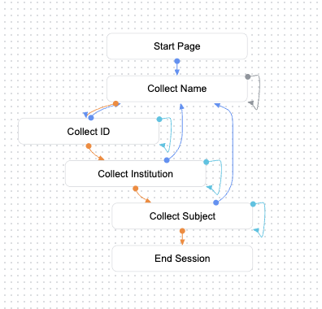

# Student Grades Chatbot

This project is a simple chatbot designed to inform students of their grades. It includes a Jupyter notebook for uploading grades to Firestore and a Google Cloud Function to authenticate and retrieve grades. The main interface is provided using a Telegram Bot.

Please be adviced that some of the contents are in spanish.

## Project Structure

```
├── LICENSE
├── README.md
├── requirements.txt
└── src
    ├── upload_grades
    │   └── upload_grades.ipynb
    └── webhooks
        ├── grades
        │   ├── main.py
        │   ├── requirements.txt
        └── telegram_server
            ├── main.py
            ├── requirements.txt
```

## Requirements

The project requires the following dependencies:
```
pandas
google-cloud-firestore
jupyter
google-auth
google-auth-oauthlib
google-auth-httplib2
functions-framework
Flask
requests
glom
python-telegram-bot
```
You can install these dependencies using the following command:

```sh
pip install -r requirements.txt
```

## Setup
We assume you have your GCP setup ready to go:

### Checklist

- [ ] Set up Google Cloud Platform (GCP) project
- [ ] Enable Firestore and all necessary APIs in GCP
- [ ] Configure authentication for GCP
- [ ] Install required dependencies
- [ ] Upload grades using Jupyter notebook
- [ ] Deploy Google Cloud Function
- [ ] Set up and configure DialogFlow CX agent
- [ ] Test the chatbot functionality

## Uploading Grades

The `upload_grades` directory contains a Jupyter notebook (`upload_grades.ipynb`) for uploading grades to Firestore.

### Steps to Upload Grades

1. Open the Jupyter notebook `upload_grades.ipynb`.
2. Follow the instructions to copy your grades data from a spreadsheet. The data should contain the following columns:
    - student_name
    - student_id
    - grade
    - course
    - university

3. Run the cells to read the data and upload it to Firestore.

## Retrieving Grades

The `webhooks/grades` directory contains a Google Cloud Function (`main.py`) to authenticate and retrieve grades.

### DialogFlow CX Agent
To better understand the flow of the DialogFlow CX agent, refer to the following diagram:

<p align="center">
    
</p>

The agent has a simple workflow collecting the requiered data to retrieve grades:

<p align="center">
    
</p>

This is how the bot looks in telegram:
<p align="center">
    
</p>


The intents, routes and entities incorporate functionality for natural language understanding (synonyms, misspellings, accents, etc.)

### Cloud Function Webhook

The Cloud Function provides an HTTP endpoint to query grades. It expects a JSON payload with the following parameters:

- nombre_completo (full name)
- numero_estudiante (student ID)
- universidad (university)
- materia (subject)

### Example Request

Requests to the webhook are handled by Dialog Flow CX

```json
{
    "detectIntentResponseId": "RESPONSE_ID_PLACEHOLDER",
    "pageInfo": {
        "currentPage": "CURRENT_PAGE_PLACEHOLDER",
        "formInfo": {
            "parameterInfo": [
                {
                    "displayName": "materia",
                    "required": true,
                    "state": "FILLED",
                    "value": "SUBJECT_PLACEHOLDER",
                    "justCollected": true
                }
            ]
        },
        "displayName": "Solicitar Materia"
    },
    "sessionInfo": {
        "session": "SESSION_PLACEHOLDER",
        "parameters": {
            "materia": "SUBJECT_PLACEHOLDER",
            "nombre_completo": {
                "name": "NAME_PLACEHOLDER",
                "original": "NAME_PLACEHOLDER"
            },
            "numero_estudiante": "STUDENT_ID_PLACEHOLDER",
            "periodo": "PERIOD_PLACEHOLDER",
            "universidad": "UNIVERSITY_PLACEHOLDER"
        }
    },
    "fulfillmentInfo": {
        "tag": "grade"
    },
    "messages": [
        {
            "text": {
                "text": [
                    "Dame un momento, estoy procesando tu información"
                ],
                "redactedText": [
                    "Dame un momento, estoy procesando tu información"
                ]
            },
            "responseType": "HANDLER_PROMPT",
            "source": "VIRTUAL_AGENT"
        },
        {
            "payload": {
                "university": "UNIVERSITY_PLACEHOLDER",
                "period": "PERIOD_PLACEHOLDER",
                "student_id": "STUDENT_ID_PLACEHOLDER",
                "subject": "SUBJECT_PLACEHOLDER",
                "name": "NAME_PLACEHOLDER"
            },
            "responseType": "HANDLER_PROMPT",
            "source": "VIRTUAL_AGENT"
        }
    ],
    "text": "ppc",
    "languageCode": "es",
    "languageInfo": {
        "inputLanguageCode": "es",
        "resolvedLanguageCode": "es",
        "confidenceScore": 1.0
    }
}
```


### Example Response

```json
{
  "fulfillment_response": {
    "messages": [
      {
        "text": {
          "text": [
            "Estimado NAME_PLACEHOLDER de la UNIVERSITY_PLACEHOLDER. Tu calificación de la materia SUBJECT_PLACEHOLDER para el período es 9.9"
          ]
        }
      }
    ]
  }
}
```


## License

This project is licensed under the Academic Free License version 3.0. See the [LICENSE](LICENSE) file for more details.

## Contributing

Contributions are welcome! Please open an issue or submit a pull request.

## Contact

For any questions or inquiries, please contact the project maintainer.